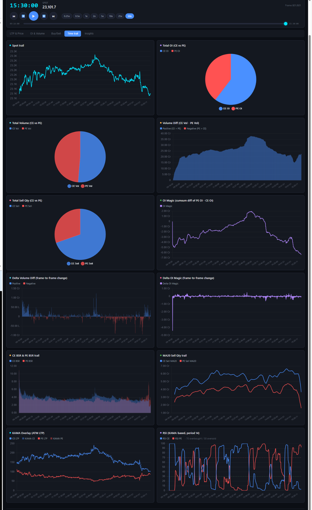

# NIFTY-Trading-Analytics-Dashboard
I developed a trading analytics dashboard to visualize market data, identify correlations among key indicators, and gain deeper insights into option price movements.
# NIFTY Options Trading Analytics Dashboard

An interactive dashboard for analysing intraday **NIFTY spot and options-market behaviour** using price, open interest, volume, buy/sell quantity, adaptive moving averages, momentum indicators, and frame-by-frame market replay.



## Overview

The dashboard combines multiple derivatives-market signals in one interface so that traders and quantitative researchers can study the relationship between:

- NIFTY spot-price movement
- Call-option and put-option open interest
- CE and PE traded volume
- Buy and sell quantities
- Frame-to-frame changes in market activity
- Adaptive trend indicators such as KAMA
- Momentum indicators such as RSI

The time-replay controls make it possible to review the trading session sequentially, accelerate playback, pause at important events, and compare several market variables at the same timestamp.

## Main Features

### Intraday market replay

- Start, pause, resume, and move between frames
- Playback-speed controls from slow motion to accelerated replay
- Session timeline from market open to market close
- Current timestamp, spot value, and frame number
- Visual synchronisation across all dashboard charts

### Spot-price analysis

The **Spot Trail** panel displays the intraday movement of the NIFTY spot index and provides the reference price series for interpreting changes in option-market activity.

### Open-interest analysis

The dashboard includes:

- Total CE open interest versus total PE open interest
- CE/PE open-interest distribution
- Cumulative open-interest imbalance
- Frame-to-frame open-interest changes
- The custom **OI Magic** indicator

In the displayed implementation:

```text
OI Magic = cumulative difference of PE OI and CE OI
```

A rising value indicates increasing PE OI relative to CE OI, while a falling value indicates increasing CE OI relative to PE OI. The interpretation should always be combined with price, volume, and strike-level context.

### Volume analysis

The dashboard tracks:

- Total CE volume versus total PE volume
- Cumulative CE–PE volume difference
- Frame-to-frame volume imbalance
- Positive and negative volume-difference regions
- Intraday changes in participation intensity

The displayed volume-difference panel uses:

```text
Volume Difference = CE Volume - PE Volume
```

### Buy/Sell analysis

The buy/sell section includes:

- Total CE sell quantity versus total PE sell quantity
- CE Buy/Sell Ratio trail
- PE Buy/Sell Ratio trail
- Moving-average comparison of CE and PE sell quantities
- Sudden spikes in directional market activity

A generic Buy/Sell Ratio can be expressed as:

```text
BSR = Buy Quantity / Sell Quantity
```

Use a small numerical stabiliser when the sell quantity is zero.

### Delta indicators

Delta panels measure the change between consecutive frames rather than the accumulated value:

```text
Delta X(t) = X(t) - X(t-1)
```

The dashboard currently displays:

- Delta Volume Difference
- Delta OI Magic

These panels help identify abrupt changes that may be hidden inside cumulative curves.

### KAMA overlay

The **Kaufman Adaptive Moving Average (KAMA)** is overlaid on ATM CE and PE last-traded prices.

KAMA adapts to market noise:

- It reacts faster during directional movement.
- It becomes smoother during noisy or sideways periods.
- CE/PE LTP crossing their respective KAMA curves may be used as a trend-state input.

### RSI analysis

The dashboard displays a KAMA-based Relative Strength Index for CE and PE series, together with conventional reference levels:

- RSI above 70: high-momentum or overbought region
- RSI below 30: low-momentum or oversold region
- RSI around 50: neutral momentum region

RSI should not be used as a standalone entry or exit signal.

## Dashboard Panels

| Panel | Purpose |
|---|---|
| Spot Trail | Tracks intraday NIFTY spot movement |
| Total OI: CE vs PE | Compares aggregate call and put open interest |
| Total Volume: CE vs PE | Compares aggregate call and put traded volume |
| Volume Difference | Shows cumulative CE volume minus PE volume |
| Total Sell Quantity | Compares CE and PE sell-side activity |
| OI Magic | Tracks cumulative PE OI minus CE OI |
| Delta Volume Difference | Shows frame-to-frame changes in volume imbalance |
| Delta OI Magic | Shows frame-to-frame changes in OI imbalance |
| CE BSR & PE BSR Trail | Compares call and put buy/sell ratios |
| MA20 Sell Quantity Trail | Smooths CE and PE sell quantities using a 20-period moving average |
| KAMA Overlay | Compares ATM option prices with adaptive moving averages |
| RSI | Measures CE and PE momentum using KAMA-based inputs |

## Suggested Data Format

The exact column names can be adapted to the project, but the input dataset should contain fields equivalent to the following:

| Column | Description |
|---|---|
| `Time` | Market timestamp |
| `Spot` | NIFTY spot price |
| `CE_LTP` | ATM or selected-strike CE last-traded price |
| `PE_LTP` | ATM or selected-strike PE last-traded price |
| `CE_OI` | Aggregate or selected-strike CE open interest |
| `PE_OI` | Aggregate or selected-strike PE open interest |
| `CE_Volume` | CE traded volume |
| `PE_Volume` | PE traded volume |
| `CE_Buy_Qty` | CE buy quantity |
| `CE_Sell_Qty` | CE sell quantity |
| `PE_Buy_Qty` | PE buy quantity |
| `PE_Sell_Qty` | PE sell quantity |

For cumulative indicators, preserve chronological ordering and calculate cumulative sums only after cleaning missing timestamps and duplicate rows.

## Example Derived Metrics

```python
df["volume_diff"] = df["CE_Volume"] - df["PE_Volume"]
df["delta_volume_diff"] = df["volume_diff"].diff()

df["oi_magic"] = (df["PE_OI"] - df["CE_OI"]).cumsum()
df["delta_oi_magic"] = df["oi_magic"].diff()

eps = 1e-9
df["CE_BSR"] = df["CE_Buy_Qty"] / (df["CE_Sell_Qty"] + eps)
df["PE_BSR"] = df["PE_Buy_Qty"] / (df["PE_Sell_Qty"] + eps)

df["CE_Sell_MA20"] = df["CE_Sell_Qty"].rolling(20).mean()
df["PE_Sell_MA20"] = df["PE_Sell_Qty"].rolling(20).mean()
```

Confirm whether the raw OI and volume fields are already cumulative before applying an additional cumulative sum.

## Quick Start

The commands below assume a Python-based dashboard with `app.py` as the entry point.

```bash
git clone <repository-url>
cd <repository-folder>

python -m venv .venv
```

Activate the environment:

**Windows**

```bash
.venv\Scripts\activate
```

**Linux/macOS**

```bash
source .venv/bin/activate
```

Install the dependencies:

```bash
pip install -r requirements.txt
```

Run the dashboard:

```bash
python app.py
```

Open the local address printed in the terminal, commonly:

```text
http://127.0.0.1:8050
```

Replace the command above with the correct Streamlit, Dash, Flask, or FastAPI command used by the project.

## Suggested Project Structure

```text
nifty-options-dashboard/
├── app.py
├── requirements.txt
├── README.md
├── assets/
│   └── dashboard-overview.png
├── data/
│   └── market_data.csv
├── src/
│   ├── data_loader.py
│   ├── indicators.py
│   ├── charts.py
│   └── callbacks.py
└── config/
    └── settings.yaml
```

## Configuration Recommendations

Keep the following values configurable rather than hard-coded:

- Market opening and closing times
- Playback interval and available playback speeds
- ATM strike-selection logic
- Number of ITM and OTM strikes included
- KAMA parameters
- RSI period and threshold levels
- Moving-average windows
- OI and volume scaling units
- Data refresh interval
- Missing-data handling policy

## Interpretation Guidelines

This dashboard is most useful when indicators are interpreted jointly.

Examples:

- A spot-price rise with increasing CE volume does not automatically imply bullishness; verify OI, sell quantity, premium movement, and strike selection.
- A large OI imbalance may represent fresh writing, fresh buying, short covering, or position rollover.
- Volume indicates activity, not direction by itself.
- Delta indicators can reveal sudden market-state changes but may also amplify bad ticks and data-feed noise.
- CE and PE comparisons should use consistent strike ranges and contract expiries.
- End-of-session spikes may be caused by position adjustment, expiry effects, or data aggregation.

## Data-Quality Checks

Before generating signals, verify that:

- Timestamps are sorted and unique.
- CE and PE data correspond to the same expiry.
- The strike-selection rule remains consistent through the session.
- Missing values are not silently converted to zero.
- OI is not double-cumulated.
- Quantities use consistent units.
- Extreme spikes are checked against the raw market feed.
- Market holidays and shortened sessions are handled correctly.

## Future Enhancements

Potential extensions include:

- Strike-wise heatmaps
- Implied-volatility and Greeks analysis
- Put–call ratio by OI and volume
- ATM/ITM/OTM aggregation
- VWAP, TWAP, EMA, HMA, and Kalman-filter overlays
- Signal alerts and event annotations
- Backtesting with transaction costs and slippage
- Live broker-API integration
- Export of charts and indicator snapshots
- Model-based regime detection
- Correlation and lead–lag analysis between spot, CE, and PE variables

## Risk Disclaimer

This software is intended for research, education, and market-data visualisation. It does not provide investment advice, trading recommendations, or guaranteed signals. Options trading involves substantial risk. Validate every indicator independently and test strategies with realistic costs, slippage, liquidity constraints, and out-of-sample data before using them in live trading.
